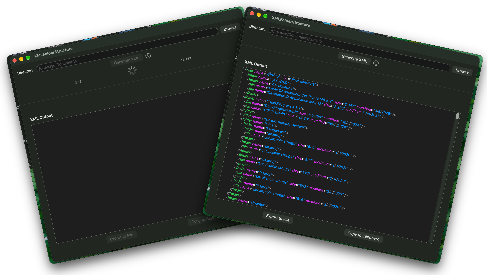

# Estructura de un directorio en XML con SwiftUI

<p align="center">

</p>

Esta aplicación macOS con SwiftUI obtiene la estructura de un directorio, incluidos los archivos y las subcarpetas de forma recursiva, y muestra el resultado en formato XML.

## Características

- **Selección de directorio**: Explora y selecciona cualquier carpeta de tu Mac
- **Generación de XML**: Crea una representación XML estructurada del directorio seleccionado
- **Indicador de progreso**: Muestra el progreso en tiempo real al procesar directorios grandes, con una barra de progreso y un contador de elementos
- **Recorrido recursivo**: Incluye todos los subdirectorios y sus archivos
- **Metadatos de archivos**: Incluye el tamaño del archivo (en bytes, formateado con separadores de punto) y la fecha de modificación de cada archivo
- **Resaltado de sintaxis**: La salida XML se muestra con resaltado de sintaxis por colores para mejorar la legibilidad (en directorios con menos de 10.000 elementos)
- **Sangría adecuada**: La salida XML se indenta correctamente para facilitar su lectura
- **Exportación a archivo**: Guarda el XML generado en un archivo con un nombre y una ubicación elegidos por el usuario
- **Copiar al portapapeles**: Copia directamente la salida XML al portapapeles para pegarla fácilmente
- **Gestión de errores**: Muestra mensajes de error claros y fáciles de entender ante cualquier problema
- **Compatibilidad con localización**: Admite un sistema de localización con un selector y 5 idiomas: alemán, inglés, francés, italiano y español

### Nota sobre el resaltado de sintaxis

La función de resaltado de sintaxis XML utiliza operaciones de expresiones regulares que pueden volverse extremadamente lentas con salidas XML grandes. Esto puede hacer que la aplicación se bloquee o deje de responder. Se ha implementado una bifurcación en la lógica de visualización de XML según el número de elementos del directorio, desactivando condicionalmente el resaltado de sintaxis para los directorios con más de 10.000 elementos:

- Directorios con ≤ 10.000 elementos: Resaltado de sintaxis completo por colores
- Directorios con > 10.000 elementos: Visualización como texto sin formato

## Formato de salida XML

```xml
<root name="directory_name" text="Root directory">
  <folder name="subfolder1">
    <file name="file1.txt" size="1.024" modified="18/10/2024" />
    <file name="file2.txt" size="2.048" modified="18/10/2024" />
    <folder name="nested_folder">
      <file name="nested_file.txt" size="512" modified="17/10/2024" />
    </folder>
  </folder>
  <file name="root_file.txt" size="4.096" modified="18/10/2024" />
</xml>
```

**Atributos:**

- `size`: Tamaño del archivo en bytes (formateado con separadores de punto para los miles)
- `modified`: Fecha de la última modificación en formato `d/M/yyyy`

## Notas

- Las carpetas vacías se incluyen en la salida con etiquetas de apertura y cierre, pero sin contenido
- El nombre del directorio raíz procede del nombre de la carpeta seleccionada
- Todas las rutas son relativas al directorio raíz seleccionado
- La salida siempre es XML bien formado, salvo que se produzcan errores en el sistema de archivos

## Requisitos

- macOS 13.0 o posterior
- Xcode 15.0 o posterior

## Compilación y ejecución

1. Abre `XMLFolderStructure.xcodeproj` en Xcode
2. Selecciona el dispositivo de destino (Mac)
3. Compila y ejecuta la aplicación (⌘R)

## Uso

1. Haz clic en el botón **Browse** para seleccionar una carpeta
2. La ruta del directorio seleccionado aparecerá en el campo de texto
3. Haz clic en el botón **Generate XML** para crear la salida XML
4. La estructura XML aparecerá en el área de texto inferior con resaltado de sintaxis por colores (para directorios con menos de 10.000 elementos):
   - **Verde**: Nombres de etiquetas XML (`root`, `folder`, `file`)
   - **Morado**: Nombres de atributos (`name`, `size`, `modified`, `text`)
   - **Azul**: Valores de atributos (entre comillas)
   - **Gris**: Corchetes y barras XML
5. Usa el botón **Export to File** para guardar el XML en un archivo; podrás elegir su ubicación y nombre
6. Usa el botón **Copy to Clipboard** para copiar el texto XML al portapapeles
7. En la barra de menús, usa `Language` > `Select language`, o el atajo de teclado `⌘ + L`, para abrir el selector de idioma

## Icono de la aplicación

El icono de la aplicación está basado en una obra de *Shuvo.Das* en [Flaticon](https://www.flaticon.com/free-icons/files-and-folders).

## Licencia

Licencia MIT: consulta el archivo LICENSE para más detalles.
