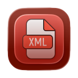

# Structure of a directory as XML in SwiftUI

<p align="center">

</p>


## Description

This macOS SwiftUI application retrieves the structure of a directory, including files and subfolders recursively, outputting the result in XML format.

## Main window image

[Main-window.md](Main-window.md)

## Features

- **Directory Selection**: Browse and select any folder on your Mac
- **XML Generation**: Creates a structured XML representation of the selected directory
- **Recursive Traversal**: Includes all subdirectories and their files
- **File Metadata**: Includes file size (in bytes, formatted with dot separators) and modification date for each file
- **Syntax Highlighting**: XML output is displayed with color-coded syntax highlighting for better readability
- **Proper Indentation**: XML output is properly indented for easy reading
- **Export to File**: Save the generated XML to a file with a user-chosen name and location
- **Copy to Clipboard**: Copy the XML output directly to your clipboard for easy pasting
- **Error Handling**: Displays user-friendly error messages for any issues

**Note**: Export to file functionality requires user-selected file read/write entitlement in Xcode.

## XML Output Format

```xml
<root name="directory_name" text="Root directory">
  <folder name="subfolder1">
    <file name="file1.txt" size="1.024" modified="18-14-2024" />
    <file name="file2.txt" size="2.048" modified="18-10-2024" />
    <folder name="nested_folder">
      <file name="nested_file.txt" size="512" modified="17-10-2024" />
    </folder>
  </folder>
  <file name="root_file.txt" size="4.096" modified="18-10-2024" />
</xml>
```

**New Attributes:**

- `size`: File size in bytes (formatted with dot separators for thousands)
- `modified`: Last modification date in format "d-M-yyyy"

## Notes

- Empty folders are included in the output with opening and closing tags but no content
- The root directory name comes from the selected folder's name
- All paths are relative to the selected root directory
- The output is always well-formed XML (assuming no file system errors)

## Requirements

- macOS 13.0 or later
- Xcode 15.0 or later

## Building and Running

1. Open `XMLFolderStructure.xcodeproj` in Xcode
2. Select your target device (Mac)
3. Build and run the application (⌘R)

## Usage

1. Click the **Browse** button to select a folder
2. The selected directory path will appear in the text field
3. Click the **Generate XML** button to create the XML output
4. The XML structure will appear in the text area below with color-coded syntax highlighting:
   - **Green**: XML tag names (root, folder, file)
   - **Purple**: Attribute names (name, size, modified, text)
   - **Blue**: Attribute values (in quotes)
   - **Gray**: XML brackets and slashes
5. Use the **Export to File** button to save the XML to a file (choose location and filename)
6. Use the **Copy to Clipboard** button to copy the XML text to your clipboard

## Appicon

Appicon based on a work by *Shuvo.Das* from [Flaticon](https://www.flaticon.com/free-icons/files-and-folders)

## License

MIT License - See LICENSE file for details
